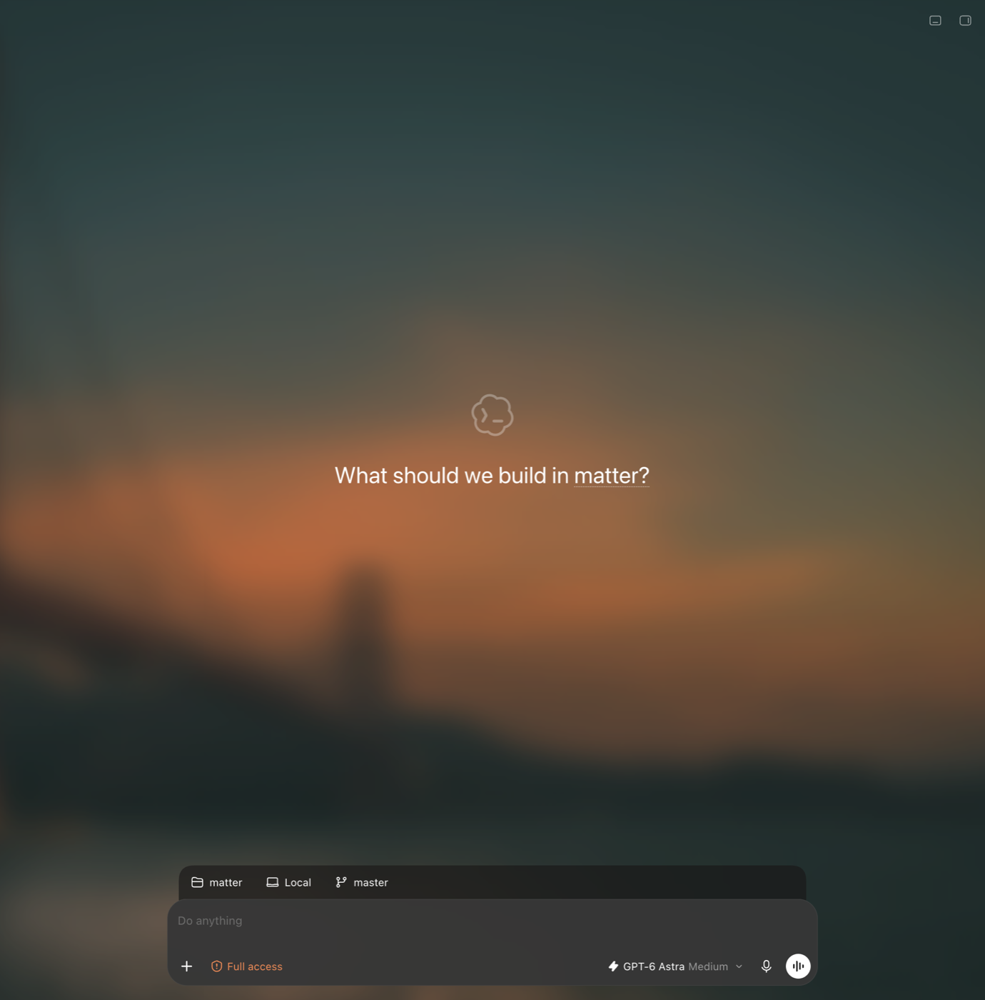

# Codex Wallpapers

Wallpapers for the ChatGPT desktop app (the Codex app): a photo behind the
whole window, crisp on the home screen and frosted behind conversations, with
a picker that searches [Wallhaven](https://wallhaven.cc) and can shuffle on a
schedule.



Codex Wallpapers builds a separate, locally patched copy of the app,
**Codex Wallpapers.app**, in `~/Applications`. Your installed ChatGPT app is
only read, never modified, and both can run side by side.

> [!WARNING]
> Unofficial and not affiliated with OpenAI. The patch targets the app's
> current structure and may need updating when the app changes. Review the
> source before running it.

## Install

```sh
curl -fsSL https://raw.githubusercontent.com/OWNER/codex-wallpapers/main/install.sh | bash
```

Requirements: macOS and the ChatGPT desktop app in `/Applications`. Node.js 20+
is used if you have it; otherwise the installer downloads an official Node.js
build (checksum verified) into `~/.codex-wallpapers` just to run the patcher.

Or from a clone:

```sh
git clone https://github.com/OWNER/codex-wallpapers.git
cd codex-wallpapers
./install.sh
```

When ChatGPT updates, run the installer again to rebuild the copy from the new
version. Your wallpaper settings are kept.

## Use

Open **Codex Wallpapers** and pick **Wallpaper → Choose Wallpaper…** (⌃⌘B).

- Search Wallhaven, filter by General / Anime / People, and sort by top, hot,
  random, or latest. Results are always safe-for-work.
- **Next Wallpaper** (⌃⌘N) shuffles; **Shuffle** changes it every 15 minutes
  to every day.
- **Dim photo** and **Glass tint** tune legibility.
- Use any `https://` image URL, or **Choose file…** for your own image.

On first launch it picks a wallpaper from this month's top list.

## With other Codex patches

Codex Wallpapers can be layered onto another patched copy of the app, such as
[Codex Subscription Router](https://github.com/b-nnett/codex-subscription-router):

```sh
curl -fsSL https://raw.githubusercontent.com/OWNER/codex-wallpapers/main/install.sh \
  | bash -s -- --onto "$HOME/Applications/Codex Subscription Router.app"
```

`--onto` adds only the wallpaper layer, in place. The target keeps its name,
bundle identifier, profile, and signing identity (it's re-signed with the same
certificate from your keychain, so macOS permissions granted to it carry
over). It refuses to modify the official app. If the other tool rebuilds its
app, run the command again.

## How it works

The ChatGPT desktop app is an Electron app. `bin/patch.mjs`:

1. Copies `/Applications/ChatGPT.app` to `~/Applications/Codex Wallpapers.app`.
2. Adds two files to `app.asar` and prepends one `require` to the app's entry
   point. The archive is edited in place by a small dependency-free asar
   writer (`lib/asar.mjs`) that appends new bytes and rewrites the header, so
   the original files and unpacked native modules stay byte for byte.
3. Gives the copy its own identity so it runs beside the official app: a new
   bundle identifier, its own profile directory (`owl-app.ini` and Electron's
   `userData`), no `codex://` or browser URL handling, and no auto-update (the
   Sparkle addon is removed so an update can't replace the patched copy).
4. Re-signs the copy ad hoc, dropping entitlements tied to OpenAI's team.

At runtime, `app/main.cjs` runs in the main process before the app loads. It
stores settings in `~/Library/Application Support/Codex Wallpapers`, runs
Wallhaven searches (Wallhaven sends no CORS headers), shuffles, adds the
Wallpaper menu, and registers `app/preload.cjs`. The preload runs in an
isolated world in the main window only. It draws a fixed backdrop behind the
app and turns the app's own surfaces into translucent, blurred tints of its
theme color (`--color-surface`), so it follows light and dark mode.

## Limitations

- macOS only.
- The copy is ad-hoc signed. Features that depend on OpenAI's team identity,
  such as push notifications and Computer Use, may not work in it. Use the
  official app for those.
- It doesn't auto-update. Re-run the installer after ChatGPT updates.

## Uninstall

```sh
bash ~/.codex-wallpapers/source/uninstall.sh   # or ./uninstall.sh from a clone
```

This removes the app, its profile, and the installer's downloads. Add
`--keep-data` to keep your settings.

## License

MIT. Wallpapers are served by [wallhaven.cc](https://wallhaven.cc) and belong
to their creators.
